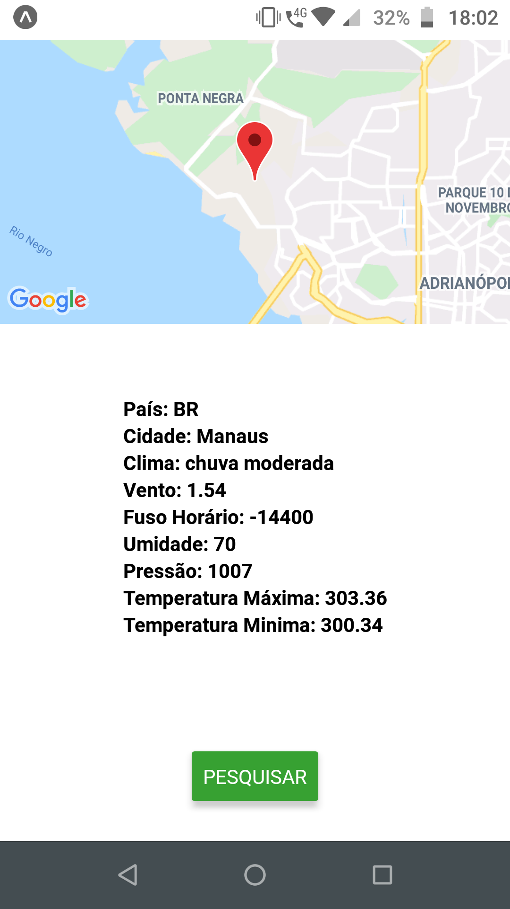
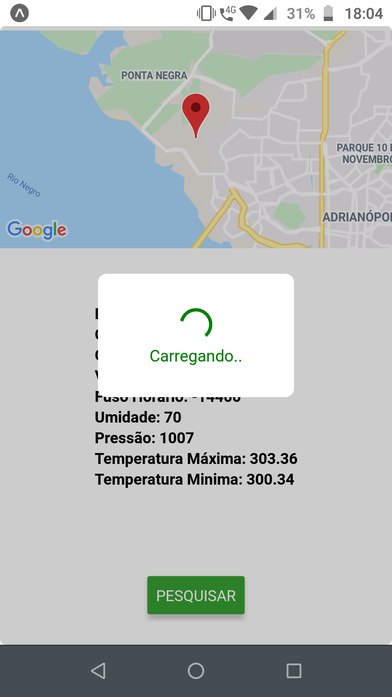

# Passos para rodar o projeto

## Para instalação local tenha nodejs instalado 
	
    git clone https://github.com/Wuirlen/desafioBuilders.git
    cd desafioBuilders
    npm install (Instalação das bibiliotecas)
    npm start (Para iniciar a aplicação)

# Imagens
1º

2°

